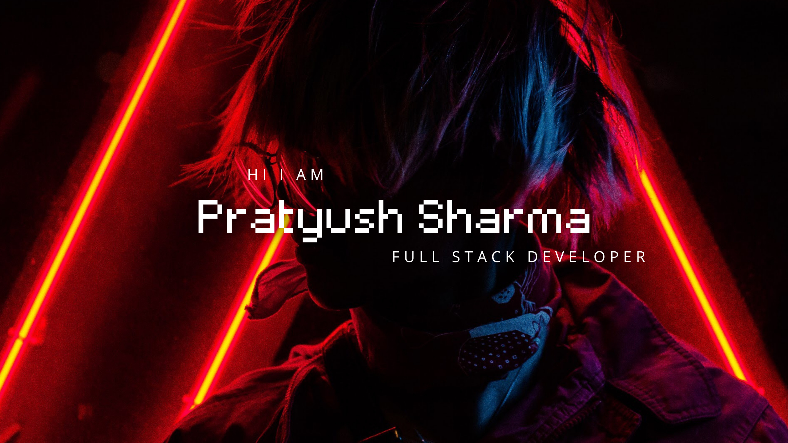

<!-- ================================================================= -->
<!-- 🚀 HEADER BANNER & TYPING ANIMATION                             -->
<!-- ================================================================= -->

<p align="center">
  
</p>

<h1 align="center">Hi 👋, I'm Pratyush Sharma</h1>
<h3 align="center">🚀 Founder & CEO of Tenimal | 💻📱 Full-Stack Web & App Developer</h3>

<div align="center">
  <a href="https://github.com/PratyushSharma27">
    
  </a>
</div>

<p align="center">
  
  <a href="https://tenimal.com" target="_blank">
    
  </a>
  
  
  
</p>

<p align="center">
  <a href="https://tenimal.com" target="_blank">
    
  </a>
  <a href="https://app.tenimal.com" target="_blank">
    
  </a>
  <a href="https://tenimal.info" target="_blank">
    
  </a>
  <a href="https://instagram.com/sharma.pratyush2710" target="_blank">
    
  </a>
  <a href="https://codepen.io/pratyush-sharma-2710" target="_blank">
    
  </a>
  <a href="https://github.com/PratyushSharma27?tab=repositories" target="_blank">
    
  </a>
</p>

---

### 👨‍💻 About Me

```yaml
identity:
  name: Pratyush Sharma
  role: Founder & CEO @ Tenimal
  specialization: Full-Stack Web & App Developer
  location: New Delhi, India 🇮🇳
architecture_focus:
  - Web Engineering: React.js, Next.js, TypeScript, TailwindCSS, Node.js
  - Mobile App Engineering: Flutter, Dart, Android & iOS Native Integration
  - Backend & Cloud: Node.js, Express, PostgreSQL, MongoDB, Supabase, Firebase
  - AI & LLM Systems: OpenAI API, RAG Pipelines, Vector Search, Automation
core_philosophy: "Build fast, think in scalable systems, turn ideas into products."
```

- 🚀 **Founder & CEO of [Tenimal](https://tenimal.com)** — Building the future of creator-led education. Bridging the gap between viral short-form discoverability and structured, premium academy learning.
- 💻 **Full-Stack Web Developer** — Designing modern, performant, and responsive web platforms with **React, Next.js, TypeScript, Node.js, Express, and modern CSS/Tailwind**.
- 📱 **Mobile App Developer** — Crafting buttery-smooth, native-feeling cross-platform mobile apps for iOS and Android using **Flutter & Dart**.
- 🧠 **AI &amp; SaaS Builder** — Engineering intelligent, full-stack products like **[CollabSpace](https://github.com/PratyushSharma27/CollabSpace)** (real-time collaboration SaaS), **[ReviewAI](https://github.com/PratyushSharma27/ReviewAI)** (automated PR intelligence), and **[StudyAi](https://github.com/PratyushSharma27/StudyAi)** (RAG-powered smart study companion).
- 📚 **Creator & Mentor** — Sharing practical development workflows, tips, and architectural insights via **Code with Pratyush**.
- ⚡ **Fun Fact**: I love taking complex, zero-to-one product visions and shipping them into high-speed production reality.

---

### 🌟 Featured Projects

<table width="100%">
  <tr>
    <td width="50%" valign="top">
      <h3 align="center">🚀 Tenimal</h3>
      <p align="center">
        <b>"Own Your Platform. Lead Your People."</b><br/>
        <i>Creator-Led Education & Community Platform</i><br/>
        <b>Founded & Engineered by Pratyush Sharma</b>
      </p>
      <ul>
        <li><b>Vision:</b> The seamless convergence of engaging short-form learning reels and high-retention private course academies.</li>
        <li><b>Tenimal Ecosystem:</b>
          <ul>
            <li>🌐 <b>Platform:</b> <a href="https://tenimal.com" target="_blank"><code>tenimal.com</code></a></li>
            <li>📱 <b>Web App:</b> <a href="https://app.tenimal.com" target="_blank"><code>app.tenimal.com</code></a></li>
            <li>ℹ️ <b>Info & Docs:</b> <a href="https://tenimal.info" target="_blank"><code>tenimal.info</code></a></li>
          </ul>
        </li>
        <li><b>Milestones:</b> 26+ custom screens designed, 30+ relational DB schemas structured for scale.</li>
        <li><b>Launch Target:</b> Public Launch: <b>January 2027</b>.</li>
      </ul>
      <p align="center">
        <a href="https://tenimal.com" target="_blank">
          
        </a>
        <a href="https://app.tenimal.com" target="_blank">
          
        </a>
        <a href="https://tenimal.info" target="_blank">
          
        </a>
      </p>
    </td>
    <td width="50%" valign="top">
      <h3 align="center">🤖 ReviewAI</h3>
      <p align="center">
        <b>"AI-Powered Code Review Platform"</b><br/>
        <i>Production PR Intelligence & Static Analysis</i>
      </p>
      <ul>
        <li><b>Capabilities:</b> Autonomous PR inspection, automated security & bug vulnerability scans, and instant refactoring recommendations.</li>
        <li><b>Tech Stack:</b> TypeScript, React.js, Express, Supabase, OpenAI API.</li>
        <li><b>Status:</b> Active Open-Source System.</li>
      </ul>
      <p align="center">
        <a href="https://github.com/PratyushSharma27/ReviewAI" target="_blank">
          
        </a>
      </p>
    </td>
  </tr>
  <tr>
    <td width="50%" valign="top">
      <h3 align="center">📚 StudyAi</h3>
      <p align="center">
        <b>"Intelligent Study Companion & SaaS"</b><br/>
        <i>RAG-Driven Document Analysis & Spaced Repetition</i>
      </p>
      <ul>
        <li><b>Capabilities:</b> Real-time contextual document query processing via RAG, automated quiz generator, and adaptive flashcards.</li>
        <li><b>Tech Stack:</b> TypeScript, React / Next.js, Vector Embeddings, LLMs.</li>
      </ul>
      <p align="center">
        <a href="https://github.com/PratyushSharma27/StudyAi" target="_blank">
          
        </a>
      </p>
    </td>
    <td width="50%" valign="top">
      <h3 align="center">⚡ CollabSpace</h3>
      <p align="center">
        <b>"All-in-One Real-Time Team Collaboration Platform"</b><br/>
        <i>Notion + Google Docs + Slack + Trello in One Unified Experience</i>
      </p>
      <ul>
        <li><b>Real-Time Docs:</b> Simultaneous multi-user rich-text editing with live presence cursors powered by TipTap &amp; WebSockets.</li>
        <li><b>Workspace Ecosystem:</b> Dynamic Kanban task boards, real-time channel messaging, activity logs, and instant notifications.</li>
        <li><b>Tech Stack:</b> React, TypeScript, Node.js, Express, Socket.IO, PostgreSQL, Supabase, Tailwind CSS.</li>
      </ul>
      <p align="center">
        <a href="https://github.com/PratyushSharma27/CollabSpace" target="_blank">
          
        </a>
      </p>
    </td>
  </tr>
</table>

---

### 🛠️ Tech Stack & Arsenal

<details open>
<summary><b>Languages & Core</b></summary>
<br/>
<p align="center">
  
</p>
</details>

<details open>
<summary><b>Web & Frontend Development</b></summary>
<br/>
<p align="center">
  
</p>
</details>

<details open>
<summary><b>Mobile App Development</b></summary>
<br/>
<p align="center">
  
</p>
</details>

<details open>
<summary><b>Backend, APIs & Cloud</b></summary>
<br/>
<p align="center">
  
</p>
</details>

<details open>
<summary><b>Databases & Caching</b></summary>
<br/>
<p align="center">
  
</p>
</details>

<details open>
<summary><b>AI, Machine Learning & Tools</b></summary>
<br/>
<p align="center">
  
</p>
<p align="center">
  
  
  
  
  
</p>
</details>

---

### 📊 GitHub Analytics & Activity

<p align="center">
  
  
</p>
<p align="center">
  
</p>

<p align="center">
  
</p>

---

### 🌐 Connect & Collaborate

<p align="center">
  <a href="https://tenimal.com" target="_blank">
    
  </a>
  <a href="https://app.tenimal.com" target="_blank">
    
  </a>
  <a href="https://tenimal.info" target="_blank">
    
  </a>
  <a href="https://instagram.com/sharma.pratyush2710" target="_blank">
    
  </a>
  <a href="https://codepen.io/pratyush-sharma-2710" target="_blank">
    
  </a>
  <a href="https://github.com/PratyushSharma27" target="_blank">
    
  </a>
</p>

<p align="center">
  <i>💬 Interested in collaborating on startups, web/mobile development, or AI applications? Feel free to reach out!</i>
</p>

<!-- ================================================================= -->
<!-- 🌊 FOOTER WAVE                                                   -->
<!-- ================================================================= -->

<div align="center">
  
</div>
